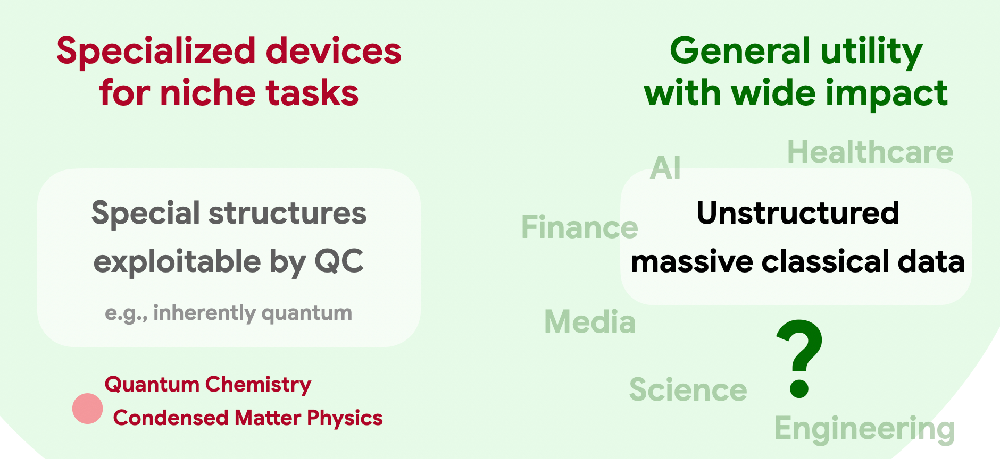
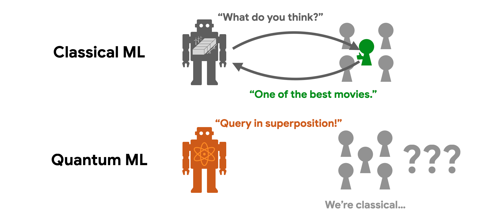
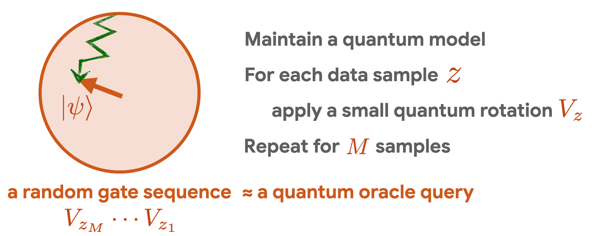
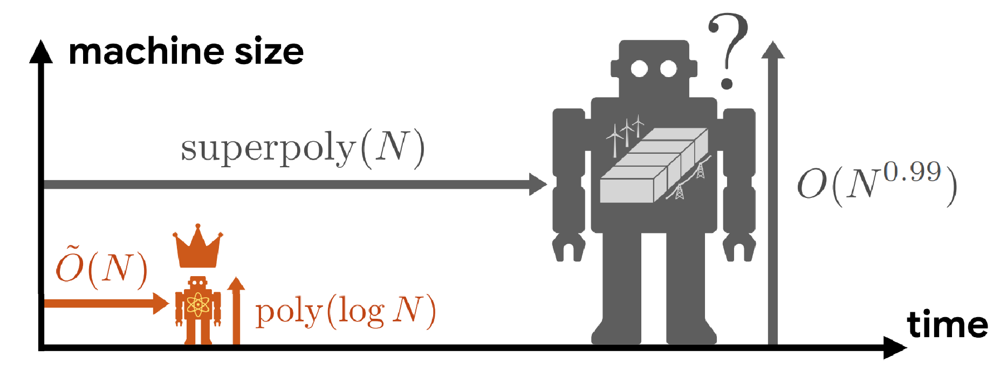

As experimental capabilities advance rapidly, the quantum computing community faces a critical elephant in the room: What will these quantum machines eventually be useful for? Will they deliver the promised broad societal impact, or will they remain highly specialized devices for exotic tasks known only to the experts?

<h2><strong>The elephant in the room</strong></h2>

Despite decades of effort, conclusive evidence of large quantum advantage in real-world applications <a href="https://arxiv.org/abs/2511.09124">remains confined to a few niche domains</a>, such as simulating quantum materials and cryptanalysis. These problems are either inherently quantum to begin with, or they possess specialized mathematical structure that quantum algorithms can easily exploit. But it seems unlikely that such structures appear broadly in everyday life.

Indeed, most applications of modern computation hinge on the processing of massive, noisy classical data, generated at an unprecedented pace across society. That is the driving force behind the overwhelming success of machine learning and AI. Since the data originates from the macroscopic classical world, there is no obvious reason it should exhibit the delicate, specialized structures that quantum computers require. To playfully adapt Richard Feynman’s famous quote: We live in an effectively classical world, dammit, and maybe classical computers and AI already suffice for most of our problems. (For those unfamiliar, Feynman originally <a href="https://arxiv.org/abs/2106.10522">quipped</a>: “Nature isn’t classical, dammit, and if you want to make a simulation of nature, you’d better make it quantum mechanical.”)

<figure></figure>

<h2><strong>The central challenge</strong></h2>

To truly unlock the power of a quantum computer, quantum algorithms typically need to access data in quantum superposition, processing many different samples simultaneously in different branches of the quantum multiverse. To use technical jargon, this is called <em>querying a quantum oracle</em>. But in reality, the classical data samples that we want to process are generated from everyday activities in a classical world, and we can only access them one at a time.

Think of the movie reviews you scroll through on a streaming platform. How would you read the plain-text reviews from a million different users all at once in a quantum superposition? This bottleneck—the challenge of efficiently accessing the classical world in quantum superposition—is known as the <em>data loading problem</em>. It has arguably been one of the main obstacles to achieving broadly applicable quantum advantage.

<figure></figure>

<h2><strong>Sketching a quantum oracle</strong></h2>

In <a href="https://arxiv.org/abs/2604.07639">this new work</a> [1], we provide a solution to this seemingly impossible challenge. We develop a framework, called <em>quantum oracle sketching</em>, that enables us to access the classical world in quantum superposition in an optimal way. Importantly, it automatically handles the noise and correlations in the data, and natively supports flexible data structures like vectors and matrices that enable machine learning applications.

The core mechanism relies on processing data as a continuous stream. For each classical data sample we observe, we apply a carefully designed, small quantum rotation to our system. By sequentially accumulating these quantum rotations, we incrementally build up an accurate approximation of the target quantum oracle, which can then be used in any quantum algorithm for data processing. Because every data sample is processed once and immediately discarded, we completely eliminate the massive memory overhead typically required to store the dataset. The fundamental price to pay for assembling quantum queries from classical data lies in the sample complexity: our algorithm consumes a number of samples that scales quadratically with the number of quantum queries we need to make. We show that this rate is optimal and fundamentally arises from the quadratic relationship between quantum amplitudes and classical probabilities governed by the Born rule.

<figure></figure>

With the data successfully loaded into the quantum computer, the final challenge is to efficiently read out classical results. To address this, we develop an efficient measurement protocol called <em>interferometric classical shadow</em>. Combined with <em>quantum oracle sketching</em>, it allows us to circumvent the data loading and readout bottleneck to construct exponentially compact classical models from massive classical data with quantum technology.

<h2><strong>Exponential quantum advantage in machine learning</strong></h2>

Using this new approach, we are finally able to find exponential quantum advantage in processing classical data and machine learning. We rigorously prove that a small quantum computer can perform large-scale classification and dimensionality reduction on massive classical data by processing samples on the fly. In contrast, any classical machine achieving the same prediction performance requires exponentially larger size. When the classical machine does not have the required exponentially large memory size, it needs super-polynomially more samples and time relative to our protocol running on a quantum device. Remarkably, this illustrates that quantum technology enables us to construct compact and accurate classical models out of classical data, which is impossible with classical machines alone unless given exponentially larger memory.

<figure></figure>

The true scale of this exponential memory advantage is staggering. A quantum processor with 300 logical qubits can outperform a classical machine built from every atom in the observable universe. Of course, to actually see such a comical contrast, we would also need universe-scale datasets and processing time.

To contextualize these results in realistic scenarios, consider a large-scale scientific experiment, like a large particle collider. Each experimental run generates a colossal volume of data. With a quantum computer, we can keep squeezing all the data into this tiny quantum chip to perform downstream machine learning tasks such as classification and dimensionality reduction. But if we only have classical machines, we would need to build massive, energy-consuming data centers to store the raw data to match the performance. Without this massive memory overhead, classical machines simply couldn’t extract the same clear signals from a single run, forcing us to repeat the massive, expensive experiment many more times to compensate. To put this into perspective, the Large Hadron Collider (LHC) at CERN generates petabytes (millions of gigabytes) of data per hour, but the data storage bottlenecks force researchers to discard all but a tiny fraction—retaining perhaps only <a href="https://proceedings.mlr.press/v42/glig14.html">one in a hundred thousand events</a>.

We validated these quantum advantages on real-world datasets, including movie review sentiment analysis and single-cell RNA sequencing. In these public datasets, we demonstrate four to six orders of magnitude (ten thousand to a million times) reduction in memory size with fewer than 60 logical qubits. Given the rapid advancements in high-rate quantum error correction codes and experimental techniques, quantum computers capable of demonstrating such applications are foreseeable in the near future. Crucially, the quantum advantage we propose likely carries a clearer positive impact for society and likely arrives sooner than the applications in cryptanalysis, where the current best estimate requires a thousand logical qubits.

<h2><strong>Towards Quantum AI</strong></h2>

Our results provide strong evidence that the utility of quantum computers extends far beyond specialized tasks, opening a path for quantum computers to be broadly useful in our everyday life. Rather than fearing that classical AI will “eat quantum computing’s lunch,” we now have rigorous evidence pointing towards a much more exciting prospect: quantum-enhanced AI overpowering classical AI.

Of course, there is still a long way to go towards the dream of quantum intelligence. Our current results establish the provable supremacy of quantum machines in foundational machine learning tasks, such as high-dimensional linear <a href="https://en.wikipedia.org/wiki/Support_vector_machine#Applications">classification</a> and <a href="https://en.wikipedia.org/wiki/Principal_component_analysis#Applications">dimensionality reduction</a>. They do not yet imply immediate utility for modern generative AI such as large language models.

That said, our results give me a strong feeling that we are living in an age strikingly reminiscent of the traditional machine learning era—an age dominated by support vector machines and random forests; an age when we relied on rigorous statistical analysis because we lacked the computational resources for large-scale heuristic exploration; an age that ultimately heralded the birth of deep learning and the AI revolution. Today, quantum AI seems to sit at a similar historical position. I cannot wait to see what quantum AI will become once we are capable of unconstrained heuristic exploration on large-scale fault-tolerant quantum computers.

To accelerate this dawn of quantum AI, we invite physicists, computer scientists, developers, and machine learning practitioners to join our efforts and help us push the boundaries of what quantum AI can achieve. To bridge the gap between abstract quantum theory and hands-on machine learning practice, we are open-sourcing our core framework. Our numerical implementation of quantum oracle sketching is built in JAX, natively supporting GPU/TPU acceleration and automatic differentiation to integrate nicely with modern machine learning pipelines. Check out the code, run the simulations, and help us shape the future of quantum AI at <a href="https://github.com/haimengzhao/quantum-oracle-sketching">github.com/haimengzhao/quantum-oracle-sketching</a>!

<h2>References</h2>

[1]. Haimeng Zhao, Alexander Zlokapa, Hartmut Neven, Ryan Babbush, John Preskill, Jarrod R. McClean, and Hsin-Yuan Huang. <a href="https://arxiv.org/abs/2604.07639">Exponential quantum advantage in processing massive classical data</a>, arXiv:2604.07639, 2026.

